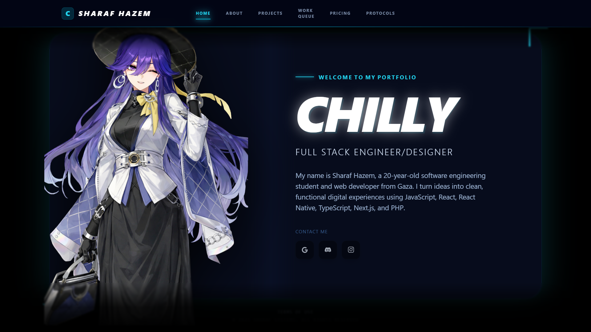
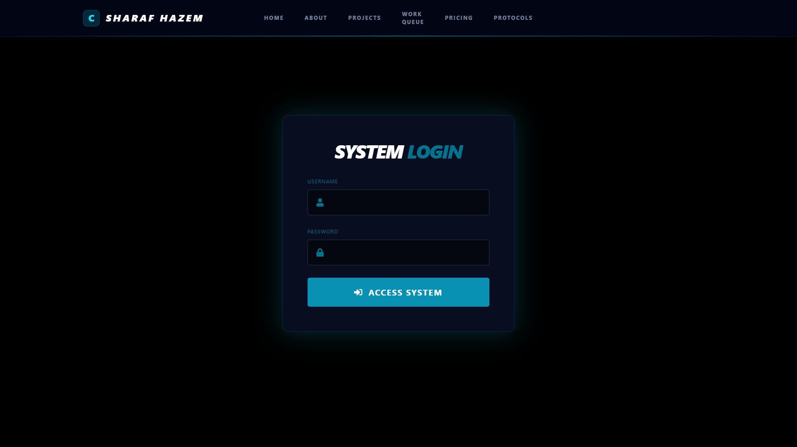

# 🚀 Chilly // Portfolio V1



> **Status:** System Online 🟢
> **Theme:** Cyberpunk / Deep Space / Glassmorphism
> **Live Demo:** [https://portfolio-chilly.vercel.app](https://portfolio-chilly.vercel.app)

## 📄 Mission Briefing
This is not just a static portfolio. It is a full-stack application built to manage my digital identity. It features a **custom Admin Dashboard** hidden behind a secure authentication system, allowing me to update projects, manage my "Experience Log", and change my bio without touching a single line of code.

Built with performance, security, and visual storytelling in mind.

## 🛠️ Tech Stack & Artifacts

| Core | Backend & Data | Styling & UI |
| :--- | :--- | :--- |
|  |  |  |
|  | **NextAuth.js** (Security) | **Framer Motion** (Animations) |
|  | **Cloudinary** (Media CDN) | **React Icons** |

## ✨ Key Features

### 🔐 System Locked (Admin Authentication)
Instead of a generic login page, the admin route (`/admin`) simulates a secure terminal.
* **Credentials:** Custom credential provider.
* **Security:** Protected routes via Next.js Middleware.
* **Visuals:** "Access Denied" / "Access Granted" glitch animations.



### 🎛️ The Dashboard (CMS)
A fully functional Content Management System built from scratch.
* **Identity Tab:** Update Bio, Avatar, and Social Links in real-time.
* **Project Hub:** Add/Delete projects with rich data (Title, Tech Stack, Images).
* **Experience Log:** Manage work history and skills cards.

### 🎨 Visual Engineering
* **Glassmorphism:** Custom blur effects using Tailwind utilities.
* **Vignette Overlay:** Custom CSS gradients for a "deep space" feel.
* **Responsive:** Fully mobile-optimized "App-like" navigation.

## ⚙️ Local Installation (Run it yourself)

1. **Clone the repository:**
   ```bash
   git clone [https://github.com/YOUR_USERNAME/portfolio-chilly.git](https://github.com/YOUR_USERNAME/portfolio-chilly.git)
   cd portfolio-chilly
